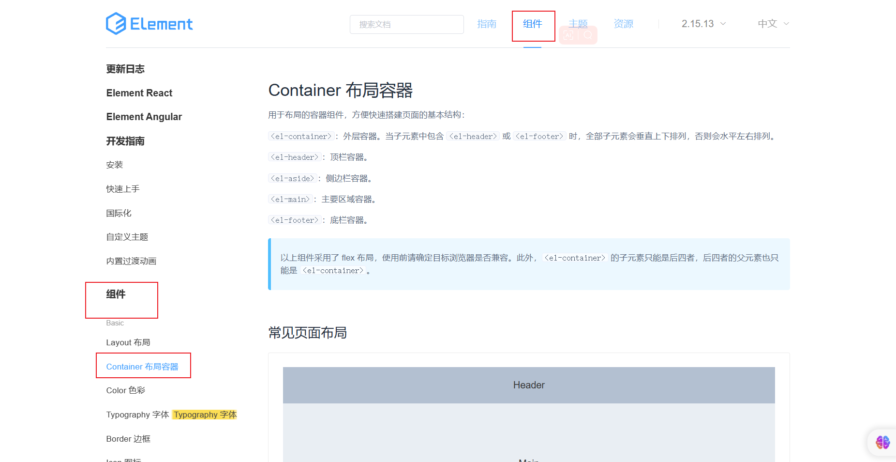
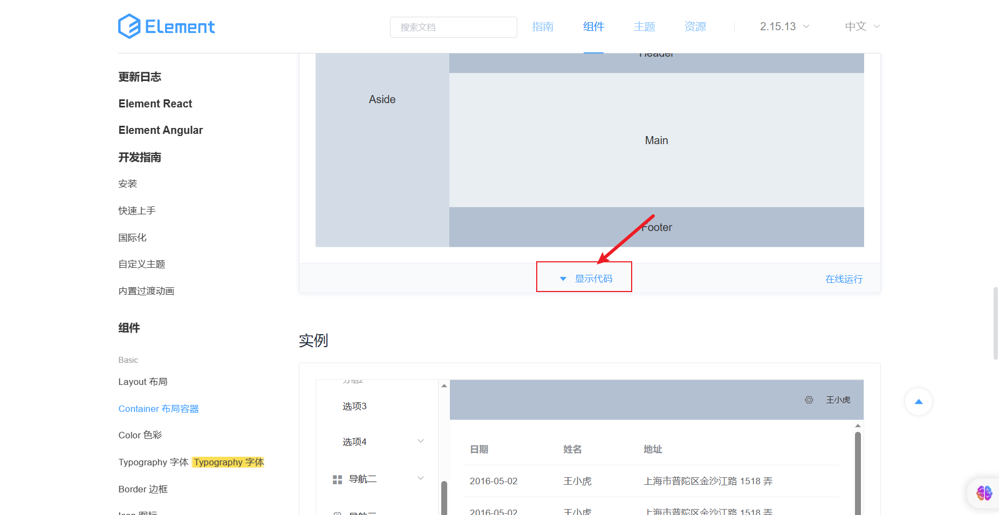
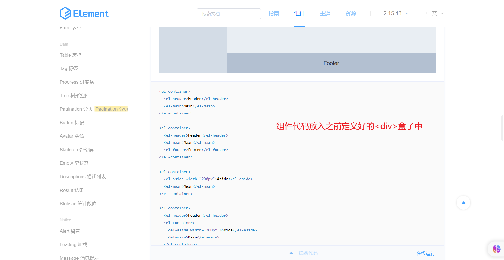
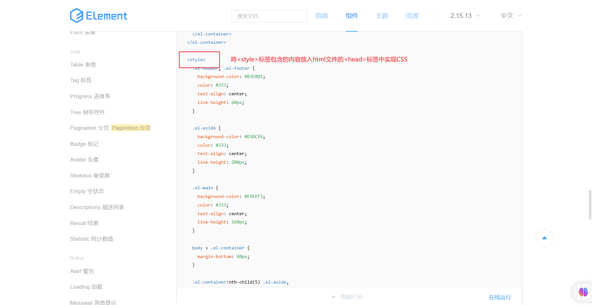
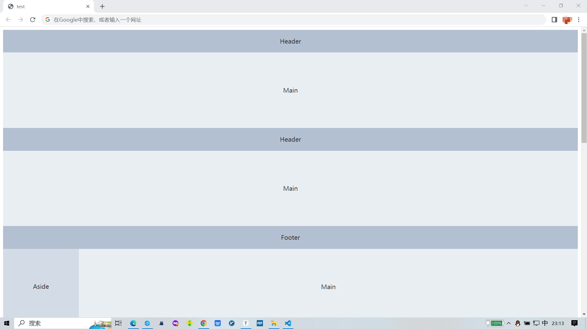

# Vue2+Element快速入门使用

#### [Vue2文档](https://v2.cn.vuejs.org/v2/guide/installation.html)

#### [Element官网](https://element.eleme.cn/#/zh-CN/component/quickstart)

### 工具：Visual Studio Code [官网下载地址](https://code.visualstudio.com/)

#### 1.创建一个.html文件,粘贴如下代码

```html
<!DOCTYPE html>
<html lang="en">

<head>
    <meta charset="UTF-8">
    <meta http-equiv="X-UA-Compatible" content="IE=edge">
    <meta name="viewport" content="width=device-width, initial-scale=1.0">
    <title>test</title>
    <!-- 引入element样式 -->
    <link rel="stylesheet" href="https://unpkg.com/element-ui/lib/theme-chalk/index.css">

</head>

<body>
    <div id="app">

    </div>

    <!--引入vue库-->
    <script src="https://cdn.jsdelivr.net/npm/vue@2.7.14/dist/vue.js"></script>
    <!-- 引入element组件库 -->
    <script src="https://unpkg.com/element-ui/lib/index.js"></script>

    <script>
        new Vue({
            el: "#app",
        })
    </script>
</body>

</html>
```

#### 2.选择需要的组件



#### 3. 点击显示代码




#### 4.复制代码到.html文档




#### 5.代码实现

```html
<!DOCTYPE html>
<html lang="en">

<head>
    <meta charset="UTF-8">
    <meta http-equiv="X-UA-Compatible" content="IE=edge">
    <meta name="viewport" content="width=device-width, initial-scale=1.0">
    <title>test</title>
    <!-- 引入样式 -->
    <link rel="stylesheet" href="https://unpkg.com/element-ui/lib/theme-chalk/index.css">
    <style>
        .el-header,
        .el-footer {
            background-color: #B3C0D1;
            color: #333;
            text-align: center;
            line-height: 60px;
        }

        .el-aside {
            background-color: #D3DCE6;
            color: #333;
            text-align: center;
            line-height: 200px;
        }

        .el-main {
            background-color: #E9EEF3;
            color: #333;
            text-align: center;
            line-height: 160px;
        }

        body>.el-container {
            margin-bottom: 40px;
        }

        .el-container:nth-child(5) .el-aside,
        .el-container:nth-child(6) .el-aside {
            line-height: 260px;
        }

        .el-container:nth-child(7) .el-aside {
            line-height: 320px;
        }
    </style>
</head>

<body>
    <div id="app">
        <el-container>
            <el-header>Header</el-header>
            <el-main>Main</el-main>
        </el-container>

        <el-container>
            <el-header>Header</el-header>
            <el-main>Main</el-main>
            <el-footer>Footer</el-footer>
        </el-container>

        <el-container>
            <el-aside width="200px">Aside</el-aside>
            <el-main>Main</el-main>
        </el-container>

        <el-container>
            <el-header>Header</el-header>
            <el-container>
                <el-aside width="200px">Aside</el-aside>
                <el-main>Main</el-main>
            </el-container>
        </el-container>

        <el-container>
            <el-header>Header</el-header>
            <el-container>
                <el-aside width="200px">Aside</el-aside>
                <el-container>
                    <el-main>Main</el-main>
                    <el-footer>Footer</el-footer>
                </el-container>
            </el-container>
        </el-container>

        <el-container>
            <el-aside width="200px">Aside</el-aside>
            <el-container>
                <el-header>Header</el-header>
                <el-main>Main</el-main>
            </el-container>
        </el-container>

        <el-container>
            <el-aside width="200px">Aside</el-aside>
            <el-container>
                <el-header>Header</el-header>
                <el-main>Main</el-main>
                <el-footer>Footer</el-footer>
            </el-container>
        </el-container>

    </div>

    <!--引入vue库-->
    <script src="https://cdn.jsdelivr.net/npm/vue@2.7.14/dist/vue.js"></script>
    <!-- 引入组件库 -->
    <script src="https://unpkg.com/element-ui/lib/index.js"></script>

    <script>
        new Vue({
            el: "#app",
        })
    </script>
</body>


</html>
```

#### 6.实现的效果


